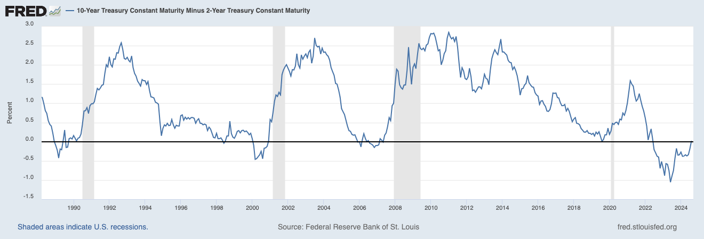

On August 28th, 2024, the 10-year Treasury yield minus the 2-year Treasury yield returned to normal, meaning the yield curve was no longer inverted. An [inverted yield curve](https://www.investopedia.com/terms/i/invertedyieldcurve.asp), where short-term rates are higher than long-term rates, has historically been a [predictor of recessions](https://www.chicagofed.org/publications/chicago-fed-letter/2018/404). 

We can see this in the graph below showing 30+ years of data for the 10Y-2Y Treasury yield spread. Soon after the spread corrects, a recession follows.

[Source](https://fred.stlouisfed.org/graph/?g=1ts7w)

If history is to repeat itself, the countdown for the final stage of entering a recession has already started.