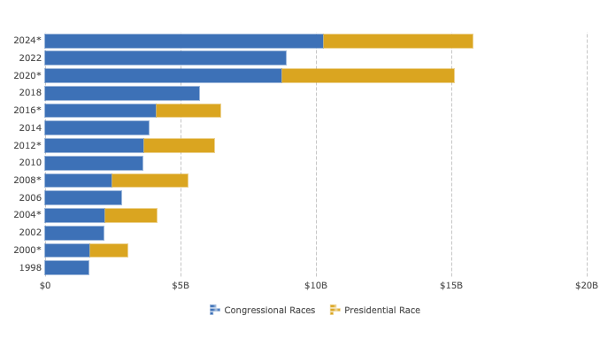
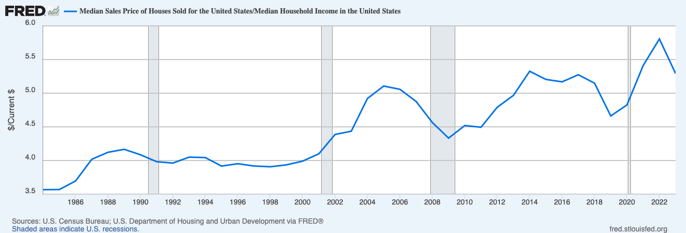
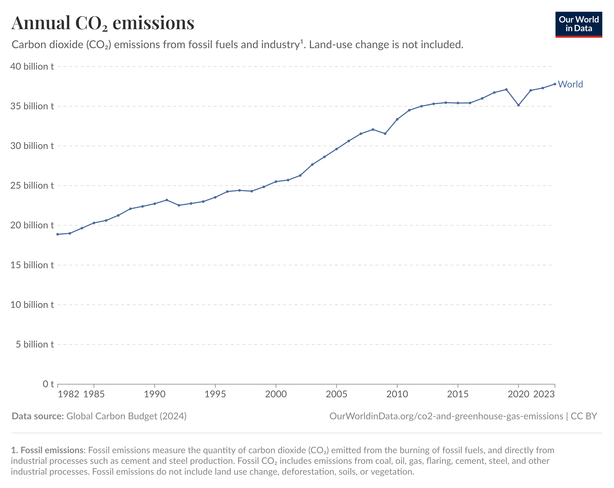
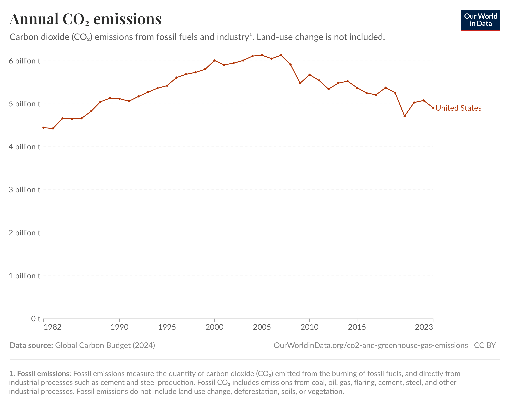

# Money in US Politics

[**Total Spending in US Elections (Presidential & Congressional)**](https://www.opensecrets.org/elections-overview/cost-of-election?cycle=2020&display=T&infl=N)
- $15.9B (2024)
- $15.1B (2020)
- $6.5B (2016)
- $6.3B (2012)
- $5.3B (2008)

# Housing Affordability for Median Earner
Ratio of Median Housing Price vs. Median Household Income

[Source](https://fred.stlouisfed.org/graph/?g=1EzWQ)

# Air Pollution

[Source](https://ourworldindata.org/grapher/annual-co2-emissions-per-country?time=1982..latest&country=~OWID_WRL)

[Source](https://ourworldindata.org/grapher/annual-co2-emissions-per-country?time=1982..latest&country=~USA)

